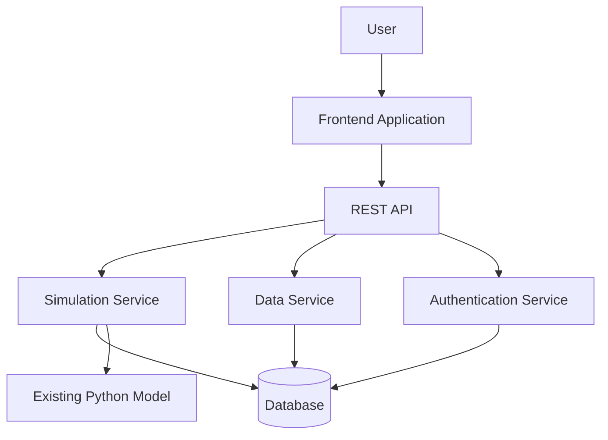
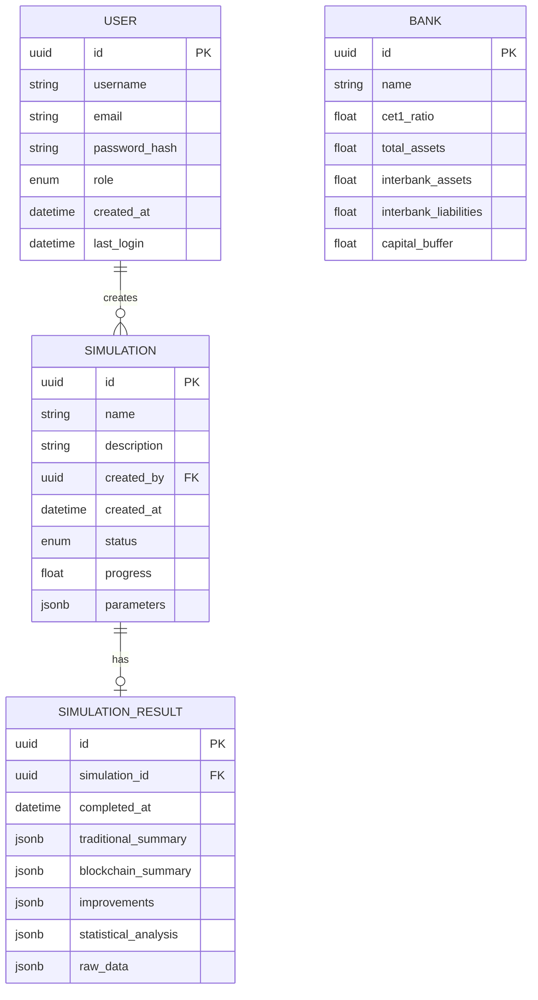
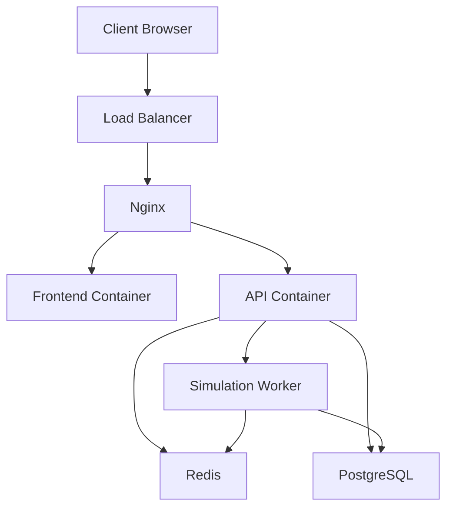

# Design Document: Systemic Risk Dashboard

## Overview

The Systemic Risk Dashboard is a full-stack web application that provides an interactive interface for the existing Monte Carlo simulation model. The application follows a modern client-server architecture with a clear separation of concerns between the frontend and backend components. The backend will expose a RESTful API that serves simulation data to the frontend, which will render interactive visualizations and provide user controls for parameter adjustments.

The application is designed to be scalable, maintainable, and user-friendly, with a focus on performance optimization for computationally intensive simulations. The design incorporates responsive UI elements, real-time data updates, and secure authentication to ensure a seamless user experience.

## Architecture

### High-Level Architecture



### Technology Stack

1. **Backend**:
   - Python Flask for the REST API
   - SQLAlchemy for ORM
   - PostgreSQL for data persistence
   - JWT for authentication
   - Celery for handling long-running simulations asynchronously
   - Redis for caching and as a message broker

2. **Frontend**:
   - React.js for the UI framework
   - Redux for state management
   - D3.js and Chart.js for interactive visualizations
   - Material-UI for component library
   - Axios for API communication

3. **DevOps**:
   - Docker for containerization
   - Nginx as a reverse proxy
   - Gunicorn as WSGI server

## Components and Interfaces

### Backend Components

#### 1. API Layer

The API layer will expose RESTful endpoints for the frontend to interact with the simulation model and retrieve data.

**Key Endpoints**:

```
GET /api/simulations - List all simulations
POST /api/simulations - Create a new simulation
GET /api/simulations/{id} - Get a specific simulation
PUT /api/simulations/{id}/parameters - Update simulation parameters
GET /api/simulations/{id}/results - Get simulation results
GET /api/simulations/{id}/status - Check simulation status

GET /api/banks - List all banks
POST /api/banks - Create a new bank
GET /api/banks/{id} - Get a specific bank
PUT /api/banks/{id} - Update a bank
DELETE /api/banks/{id} - Delete a bank

POST /api/auth/login - Authenticate user
POST /api/auth/logout - Logout user
POST /api/auth/register - Register new user
POST /api/auth/reset-password - Reset password
```

#### 2. Simulation Service

The Simulation Service will handle the execution of Monte Carlo simulations, parameter validation, and result processing.

**Key Responsibilities**:
- Validate simulation parameters
- Execute simulations asynchronously
- Process and format simulation results
- Cache frequently accessed results
- Track simulation progress

#### 3. Data Service

The Data Service will manage bank data, exposure matrices, and other data required for simulations.

**Key Responsibilities**:
- CRUD operations for bank data
- Generate and manage exposure matrices
- Import/export data in various formats
- Data validation and consistency checks

#### 4. Authentication Service

The Authentication Service will handle user authentication, authorization, and session management.

**Key Responsibilities**:
- User authentication
- Role-based access control
- Session management
- Password reset functionality

### Frontend Components

#### 1. Dashboard Layout

The main dashboard layout will provide a consistent structure for the application with navigation, user controls, and content areas.

**Key Elements**:
- Header with application title and user information
- Navigation sidebar
- Main content area
- Footer with additional links and information

#### 2. Visualization Components

The visualization components will render interactive charts and graphs based on simulation results.

**Key Visualizations**:
- Failure distribution histograms
- Cumulative probability charts
- Box plots for comparison
- Heatmaps for bank failure correlations
- Time series for simulation history

#### 3. Parameter Control Panel

The parameter control panel will allow users to adjust simulation parameters and run new simulations.

**Key Controls**:
- Numeric inputs for simulation parameters
- Sliders for ranges
- Dropdown selectors for options
- Submit and reset buttons

#### 4. Bank Data Manager

The bank data manager will provide a tabular interface for viewing and editing bank data.

**Key Features**:
- Editable data grid
- Validation indicators
- Add/remove bank controls
- Import/export functionality

#### 5. Results Explorer

The results explorer will allow users to browse, compare, and export simulation results.

**Key Features**:
- Saved simulation list
- Comparison view
- Export controls
- Sharing options

## Data Models

### Core Data Models

#### 1. User

```json
{
  "id": "UUID",
  "username": "string",
  "email": "string",
  "password_hash": "string",
  "role": "enum(admin, analyst, viewer)",
  "created_at": "datetime",
  "last_login": "datetime"
}
```

#### 2. Bank

```json
{
  "id": "UUID",
  "name": "string",
  "cet1_ratio": "float",
  "total_assets": "float",
  "interbank_assets": "float",
  "interbank_liabilities": "float",
  "capital_buffer": "float"
}
```

#### 3. Simulation

```json
{
  "id": "UUID",
  "name": "string",
  "description": "string",
  "created_by": "User.id",
  "created_at": "datetime",
  "status": "enum(pending, running, completed, failed)",
  "progress": "float",
  "parameters": {
    "shock_prob": "float",
    "n_sim": "integer",
    "systemic_threshold": "integer",
    "trad_lgd": "float",
    "bc_lgd": "float",
    "bc_liability_reduction": "float"
  }
}
```

#### 4. SimulationResult

```json
{
  "id": "UUID",
  "simulation_id": "Simulation.id",
  "completed_at": "datetime",
  "traditional_summary": {
    "average_failures": "float",
    "max_failures": "integer",
    "std_dev_failures": "float",
    "probability_systemic_event": "float"
  },
  "blockchain_summary": {
    "average_failures": "float",
    "max_failures": "integer",
    "std_dev_failures": "float",
    "probability_systemic_event": "float"
  },
  "improvements": {
    "average_failures": "float",
    "max_failures": "integer",
    "probability_systemic_event": "float",
    "std_dev_failures": "float"
  },
  "statistical_analysis": {
    "t_stat": "float",
    "p_value": "float",
    "cohens_d": "float",
    "effect": "string"
  },
  "raw_data": {
    "traditional_failures": "array",
    "blockchain_failures": "array"
  }
}
```

### Database Schema



## Error Handling

### API Error Responses

All API errors will follow a consistent format:

```json
{
  "error": {
    "code": "string",
    "message": "string",
    "details": {}
  }
}
```

### Common Error Codes

- `400` - Bad Request (invalid parameters)
- `401` - Unauthorized (authentication required)
- `403` - Forbidden (insufficient permissions)
- `404` - Not Found (resource doesn't exist)
- `409` - Conflict (resource already exists)
- `422` - Unprocessable Entity (validation error)
- `500` - Internal Server Error

### Frontend Error Handling

The frontend will implement:
- Form validation with immediate feedback
- Error boundaries to prevent UI crashes
- Toast notifications for API errors
- Retry mechanisms for transient failures
- Graceful degradation when services are unavailable

## Testing Strategy

### Backend Testing

1. **Unit Tests**:
   - Test individual functions and methods
   - Mock external dependencies
   - Focus on business logic and validation

2. **Integration Tests**:
   - Test API endpoints
   - Verify database interactions
   - Test authentication flows

3. **Performance Tests**:
   - Benchmark simulation execution times
   - Test API response times under load
   - Identify bottlenecks

### Frontend Testing

1. **Unit Tests**:
   - Test individual components
   - Verify state management
   - Test utility functions

2. **Component Tests**:
   - Test component rendering
   - Verify user interactions
   - Test form validation

3. **End-to-End Tests**:
   - Test complete user flows
   - Verify integration between frontend and backend
   - Test responsive design

### Continuous Integration

- Automated test execution on code changes
- Code coverage reporting
- Performance regression detection

## Security Considerations

1. **Authentication and Authorization**:
   - JWT-based authentication
   - Role-based access control
   - Session timeout and refresh tokens

2. **Data Protection**:
   - HTTPS for all communications
   - Encryption of sensitive data
   - Input validation and sanitization

3. **API Security**:
   - Rate limiting
   - CORS configuration
   - API key management for external integrations

## Deployment Architecture



## Performance Optimization

1. **Backend Optimizations**:
   - Caching of simulation results
   - Asynchronous processing of long-running simulations
   - Database query optimization
   - Efficient data serialization

2. **Frontend Optimizations**:
   - Code splitting and lazy loading
   - Memoization of expensive calculations
   - Virtual scrolling for large datasets
   - Progressive loading of visualizations

## Accessibility Considerations

1. **WCAG Compliance**:
   - Proper semantic HTML
   - Keyboard navigation
   - Screen reader compatibility
   - Sufficient color contrast

2. **Responsive Design**:
   - Mobile-friendly layouts
   - Adaptive visualizations
   - Touch-friendly controls

## Internationalization

1. **Language Support**:
   - Translation infrastructure
   - Right-to-left language support
   - Locale-specific formatting

2. **Cultural Considerations**:
   - Date and number formatting
   - Currency display
   - Time zone handling